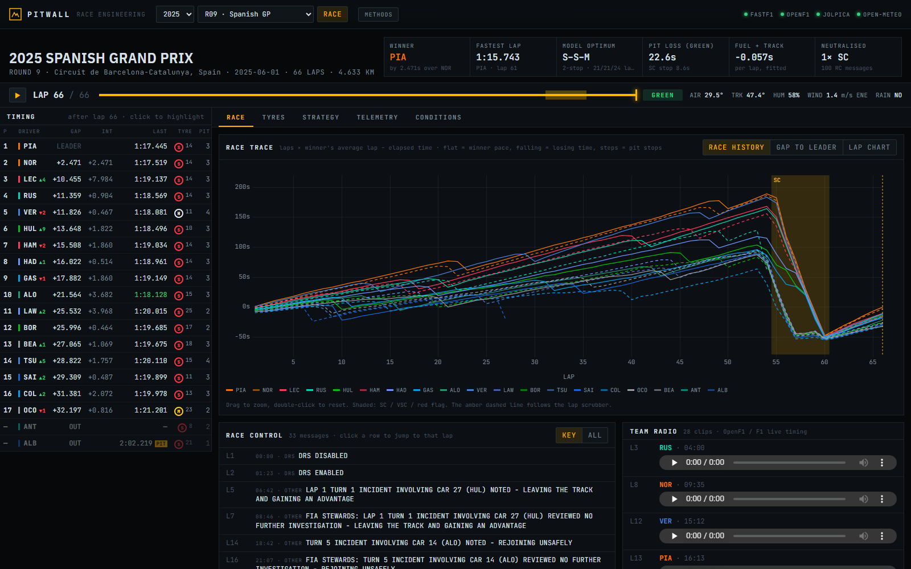

# pitwall

**Race engineering analysis for real Formula 1 races.** pitwall pulls official timing, telemetry,
weather and radio from four public archives. It fits a tyre degradation model to every race and
uses it to score strategies, measure pit loss and audit undercuts. The results appear in a
pit-wall style console.

**[Live demo →](https://zishaan1911.github.io/pitwall/)** (every Grand Prix and sprint of the current
and previous season, refreshed each Monday)



Nothing is simulated. Every number comes from the data sources below or from a model fitted to them.

## What it shows

| View | Contents |
| --- | --- |
| **Timing tower + lap scrubber** | Classification after any lap, with gaps, intervals, tyre and age, stops and positions gained. Scrub, step (← →) or replay (space); every chart follows the selected lap. |
| **Race** | Race history chart (gap to the winner's average pace), gap to leader and lap chart, with SC/VSC/red-flag shading. Also the race control feed, team radio clips, and a classification with model pace, speed traps and on-track passes. |
| **Tyres** | Stint timeline, a degradation scatter with fitted wear curves, the coefficient table (estimate ± SE), and a fuel- and tyre-corrected pace ranking. |
| **Strategy** | Exhaustive 1–3 stop optimiser with pit windows, a one-stop cost curve, green/SC/VSC pit loss with lane and stationary times, each driver's real strategy scored against the optimum, and an undercut/overcut ledger. |
| **Telemetry** | Fastest-lap comparison of any two drivers: speed, Δ-time, throttle, brake, gear, RPM and DRS, synced and zoomable. Also a mini-sector dominance map, corner apex speeds and an elevation profile. |
| **Conditions** | Trackside temperature, humidity and wind, a wind rose, and hourly reanalysis weather (cloud, solar radiation, rain, gusts). Also track temperature vs model residuals, neutralisations and the championship before and after the round. |

## Data sources

| Source | Used for |
| --- | --- |
| [FastF1](https://github.com/theOehrly/Fast-F1) (F1 live-timing archive) | Laps, sectors, positions, tyre compound and age, pit in/out, track status, race control, trackside weather, car telemetry and X/Y/Z position, circuit corners |
| [OpenF1](https://openf1.org) | Pit lane and stationary times, team radio recordings, on-track overtakes |
| [Jolpica](https://github.com/jolpica/jolpica-f1) (Ergast successor) | Circuit coordinates, drivers' championship before and after the round |
| [Open-Meteo](https://open-meteo.com) | Hourly ERA5-based reanalysis at the circuit: cloud cover, shortwave radiation, precipitation, gusts |

FastF1 is required. The other three are optional: if one is unavailable, the bundle is still built
and the header shows which source was missing.

## Methods

### Representative laps

A lap trains the model only if all of these hold:

- It isn't lap 1, an in-lap or an out-lap.
- It was run entirely under green (no yellow, SC, VSC or red).
- FastF1 marks it accurate.
- It is within 5 s of the driver's median.

### Tyre model

```
t = μ[driver] + κ[compound] + β₁[compound]·age + β₂[compound]·age² + δ·lap + ε
```

- **μ**: each driver/car's pace.
- **κ**: compound offset against the most-used compound.
- **β**: wear against tyre age.
- **δ**: the per-lap trend from fuel burn-off and track evolution. It is separable from wear
  because tyre age resets at every stop while the lap count keeps rising.

The fit uses iteratively reweighted least squares with Huber weights (k = 1.345), so traffic
laps and small mistakes are down-weighted rather than bending the curve. Standard errors use a
MAD-based residual scale. β₂ is kept only where it is positive and significant (t > 2). A
compound that no driver paired with another is dropped, because its offset would be
indistinguishable from driver pace.

The model recovers known parameters from synthetic races in the test suite. On real races it
lines up with what happened. For example, in Bahrain 2024 it measured 24.2 s of green-flag pit
loss (n = 41) and −0.072 s/lap of fuel and track gain, and it picked the soft–hard–hard 2-stop
that most of the field ran.

### Pit loss

For each stop: in-lap + out-lap − the model's prediction for those two laps on track, using the
driver's own μ and the real tyre ages. Stops are split by conditions: green, SC and VSC.

### Strategy optimiser

Every plan with at least two dry compounds is scored as the sum of the wear cost of each stint
plus stops × green pit loss. The δ·lap term is identical for every plan, so it cancels and all
1-, 2- and 3-stop plans can be enumerated exhaustively. Stints are capped at the oldest tyre
actually run on that compound + 3 laps, so no recommendation rests on long extrapolation. Real
strategies are scored with the same model, using their true tyre ages. Each stop is charged the
loss for its conditions: less under a safety car, nothing under a red flag.

### Undercut ledger

This covers cars within 4 s of each other, stopping up to 6 laps apart on the same stop number,
with green flag throughout. It compares the gap on the lap before the first stop with the gap
once both have completed their out-laps.

### Limitations

- No tyre–fuel interaction, so stint order doesn't change modelled time.
- Traffic is handled statistically, not modelled.
- The optimiser assumes a green race; it does not forecast safety cars.
- Wet and mixed races are displayed, but the dry optimiser is switched off for them.

## Architecture

```
FastF1 ─┐
OpenF1 ─┼─► backend/pitwall ──► JSON bundle per session ──► frontend (React + uPlot)
Jolpica ┤     sources/   adapters with retries             <year>/<round>-R/session.json
Meteo  ─┘     analysis/  laps, degradation, pit stops,     <year>/<round>-R/tel/<DRV>.json
                         strategy, battles, telemetry
              app.py     FastAPI: builds bundles on demand
              export.py  prebuilds bundles for the static site
```

The dashboard reads the same files in both modes:

- **Live** (`/api`): FastAPI builds any session from 2018 onward on first request (about a
  minute), then serves it from disk.
- **Static** (`./data`): the GitHub Pages workflow prebuilds the last two seasons. Bundles are
  cached between runs, so the Monday job only fetches the new race.

## Running it

Requirements: Python 3.11+ and Node 20+.

```bash
# backend
cd backend
python -m venv .venv && source .venv/bin/activate   # Windows: .venv\Scripts\activate
pip install -e ".[dev]"
uvicorn pitwall.app:app --port 8000

# frontend (another terminal)
cd frontend
npm install
npm run dev          # http://localhost:5173, proxies /api to :8000
```

After `npm run build`, the backend also serves the built dashboard itself at http://localhost:8000.

To build a static copy instead:

```bash
cd backend && python -m pitwall.export --season 2025      # writes JSON bundles to ../data
cd ../frontend && npm run dev:static                       # serves the app over ../data
```

Settings (environment variables): `PITWALL_DATA` (bundle directory, default `data/`),
`PITWALL_CACHE` (FastF1 cache), `PITWALL_SEASONS` (e.g. `2024,2025`).

## Tests

```bash
cd backend && pytest        # tyre model, optimiser vs brute force, pit loss, undercuts
cd frontend && npm test     # timing tower classification, helpers
```

CI runs ruff, pytest, oxlint, vitest and a production build on every push.

## Licence

MIT. F1, FORMULA 1 and related marks are trademarks of Formula One Licensing B.V. This is an
unofficial project and is not associated with the Formula 1 companies.
